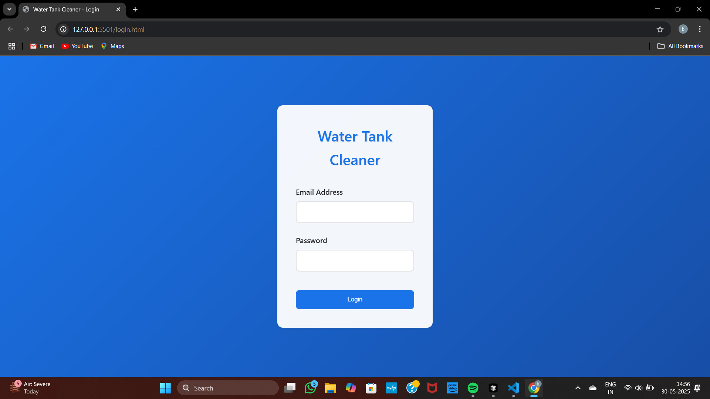
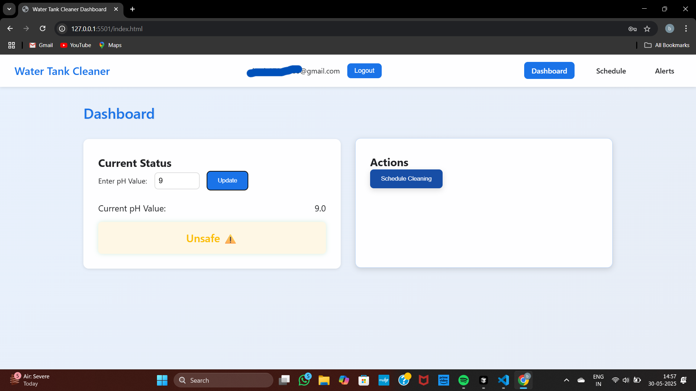
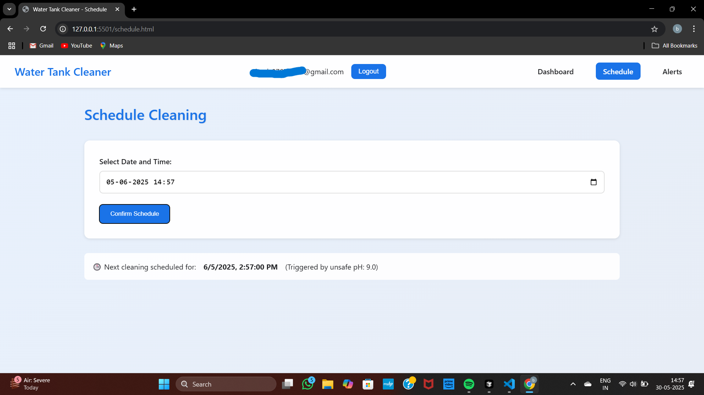
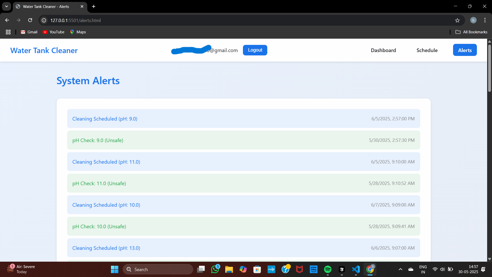
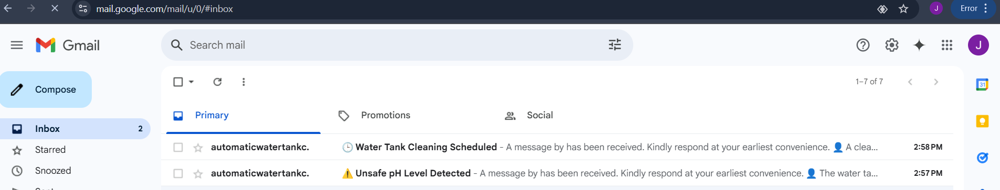
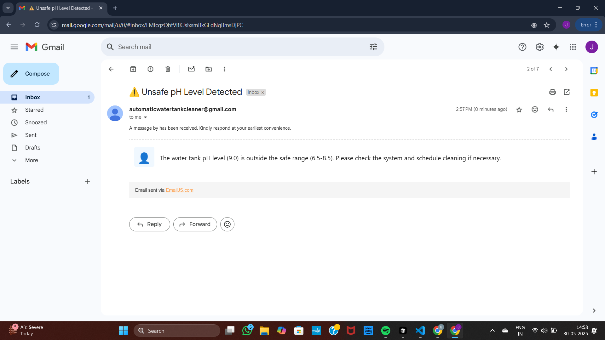
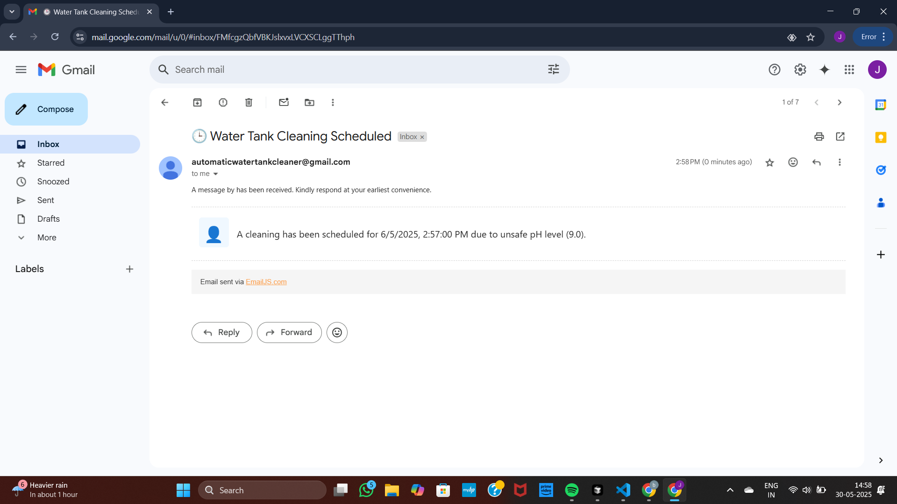

# Automatic Water Tank Cleaner

This project is a web-based dashboard for monitoring and managing the cleaning of a water tank. It features user authentication, pH monitoring, cleaning scheduling, system alerts, and automated email notifications.

## Table of Contents
- [Project Overview](#project-overview)
- [Features](#features)
- [Screenshots & Explanations](#screenshots--explanations)
- [How It Works](#how-it-works)
- [Tech Stack](#tech-stack)

---

## Project Overview
The Automatic Water Tank Cleaner system allows users to:
- Log in securely
- Monitor the pH value of their water tank
- Schedule cleaning operations
- Receive alerts and notifications for unsafe pH levels
- Get email notifications for critical events

---

## Features
- **User Login:** Secure access to the dashboard
- **Dashboard:** Real-time pH monitoring and water safety status
- **Schedule Cleaning:** Set up cleaning times manually or automatically
- **System Alerts:** View history of pH checks and cleaning events
- **Email Notifications:** Automated emails for unsafe pH and scheduled cleaning

---

## Screenshots & Explanations

### 1. Login Page

- **File:** `login.html`
- **Description:** Users enter their email and password to access the dashboard. The form validates input and, upon successful login, redirects to the dashboard.
- **Key Functions:** Form validation, user authentication (handled in `script.js`).

---

### 2. Dashboard

- **File:** `index.html`
- **Description:** Main dashboard after login. Shows the current pH value, allows users to update it, displays water safety status, and provides navigation to other features.
- **Key Functions:** pH value input and validation, status display (safe/unsafe), navigation bar, logout.

---

### 3. Schedule Cleaning

- **File:** `schedule.html`
- **Description:** Users can select a date and time for the next cleaning. Displays the next scheduled cleaning and the reason (e.g., triggered by unsafe pH).
- **Key Functions:** Date/time picker, schedule confirmation, display of upcoming cleaning events.

---

### 4. System Alerts

- **File:** `alerts.html`
- **Description:** Lists all system alerts and cleaning schedules. Highlights unsafe pH readings and scheduled cleanings.
- **Key Functions:** Alert log display, color-coded status for easy identification.

---

### 5. Email Notifications (Inbox)

- **Description:** Shows the email notifications sent by the system for unsafe pH and scheduled cleaning.
- **Key Functions:** Integration with EmailJS, automated email alerts for critical events.

---

### 6. Unsafe pH Level Email

- **Description:** Notifies the user about unsafe pH levels in the water tank.
- **Key Functions:** Dynamic email content based on system status.

---

### 7. Cleaning Scheduled Email

- **Description:** Confirms cleaning schedules with details, sent automatically when a cleaning is scheduled.
- **Key Functions:** Dynamic email content based on scheduled events.

---

## How It Works
1. **Login:** User logs in with email and password.
2. **Dashboard:** User can monitor and update the pH value. Unsafe pH triggers alerts and emails.
3. **Schedule Cleaning:** User can schedule cleaning manually or it is triggered automatically by unsafe pH.
4. **Alerts:** User can view the history of pH checks and cleaning events.
5. **Email Notifications:** User receives emails for unsafe pH and scheduled cleaning events.

---

## Tech Stack
- **Frontend:** HTML, CSS, JavaScript
- **Email Service:** [EmailJS](https://www.emailjs.com/)

---

## Project Structure
- `login.html`, `index.html`, `schedule.html`, `alerts.html` — Main pages
- `styles.css` — Styling
- `script.js` — Main logic and EmailJS integration
- `screenshots/` — Project screenshots for documentation

---

Feel free to explore the code and try out the features! 